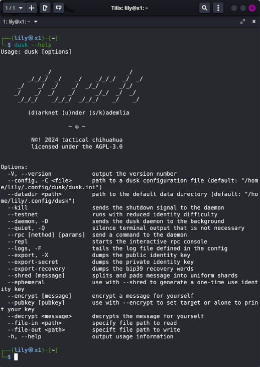
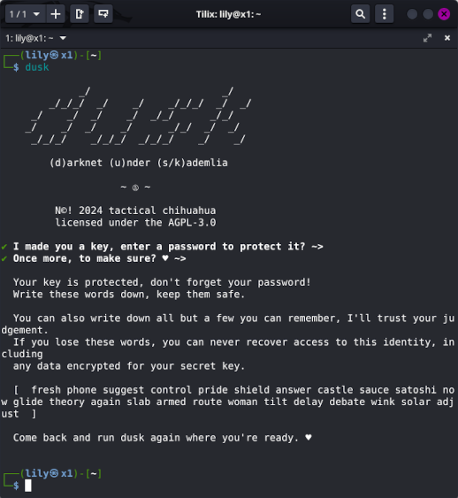
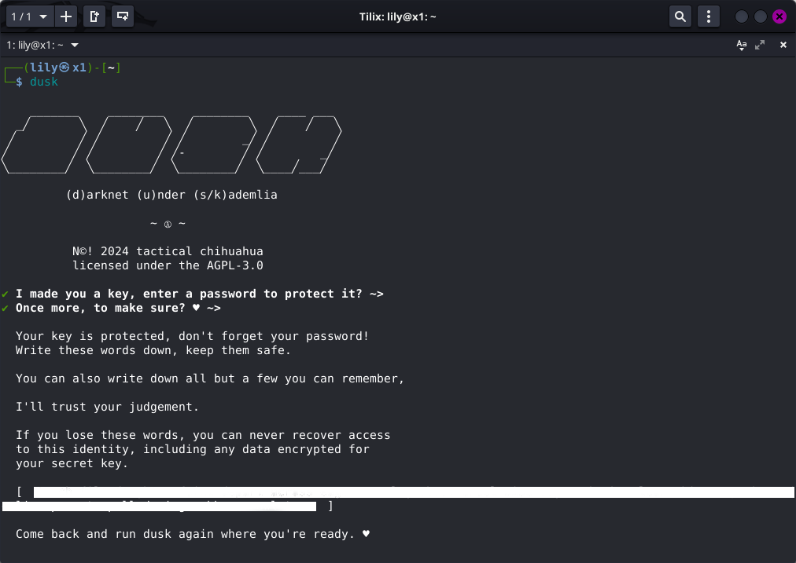
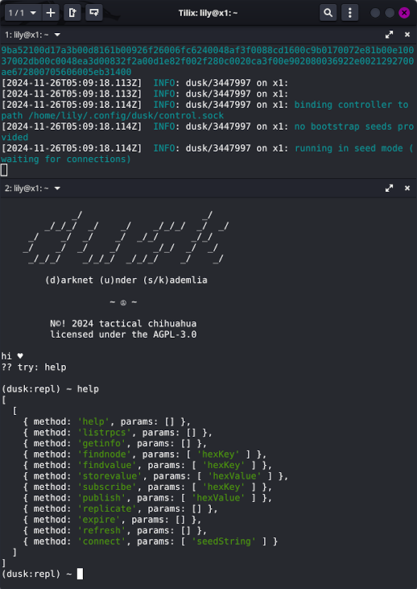
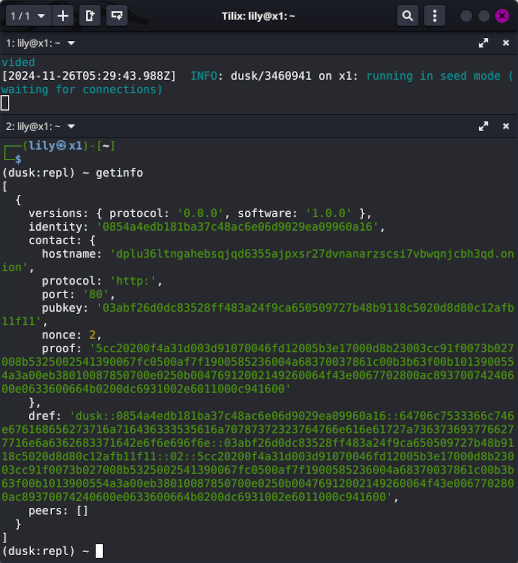

# <center><a href="https://github.com/lilyannehall/dusk">dusk</a></center> 
# <center><em>darknet under s/kademlia</em></center>
## --
#### <center>Lily Anne (lily@tacticalchihuahua.lol)</center>
#### <center>November 22, 2024</center>
## --

>
* [Background](#background)
1. [History](#history) 
1. [Purpose](#purpose)
1. [Threat Model](#threat-model)
* [Specifcation](#specification) 
1. [Design](#design) 
1. [Attacks](#attacks) 
1. [Protocol](#protocol) 
1. [Implementation](#implementation)
* [User Guide](#user-guide)
1. [Installation](#installation) 
1. [Testing](#testing) 
1. [Interfaces](#interfaces) 
1. [Sneakernets](#sneakernets) 
* [Appendix](#appendix)
1. [References](#references) 
1. [Licenses](#licenses) 
>

## --

**dusk is a content-addressable anonymous distributed hash table**. It aims to provide activists, journalists, and researchers a means for storing and sharing sensitive material in a manner that resists censorship and preserves end-user privacy. 

It does not reveal who is storing or accessing the data and it does not rely on centralized infrastructure. There is no server to be hacked, no company to be subpoenaed. 

The purpose of this text is to explain the motivation, design concepts, network protocol, and implementation details. A user guide is also included for information on how to run and interact with dusk.

See you never.

## --

## Background

## --

### History

In 2014, I picked up a book in which a well known editor and activist abstractly describes a hypothetical system where documents can be stored across some number of computers. The files are indexed by their hash. This property is called "content-addressable" and it means that every piece of data can be reduced to a single unique number and that number is used as a lookup key. He discusses how this could resist censorship and how such a system could be relevant to WikiLeaks.

About a year later, I found myself participating in a hackathon. Several months before, I had begun working on an implementation of [Kademlia](https://www.scs.stanford.edu/~dm/home/papers/kpos.pdf), which is an algorithm for a [distributed hash table](https://en.wikipedia.org/wiki/Distributed_hash_table) . A DHT is a way of storing a simple data structure across a number of computers. I had started working on this implementation as a learning exercise.

So, I started thinking about what we could build with this framework and decided to try to implement this hypothetical document storage network that I had read about. We called it BYRD (Bring Your Restricted Documents). It was simple: drop a file in the webpage, our logo - a goofy-looking tropical bird - would start "chomping" away, splitting the file into pieces, encrypting them, and storing the pieces across a few different computers. 

The metadata (the information about where the pieces were, what order they go in, and how to decrypt them) would get stored too and you could put it all back together by plugging in a single key.

I was job searching at the time and had been introduced to a few people working on a new startup called [Storj](https://storj.io). They had heard about the hackathon project and it sounded similar to their whitepaper - absent the inclusion of a blockchain. I joined Storj, excited about the opportunity to work full time developing the kind of technology that could enable platforms like BYRD to help journalists and whistle blowers. 

I knew from the beginning that Storj could never be the project I wanted BYRD to be, but it was an opportunity to further the development of related technology that would be free and open source. We had some interesting problems to solve. How do you manage an autonomous customer-provider relationship? How do you ensure quality of service when your infrastructure runs in the basements of strangers? How do you protect the privacy of users? How do you... **not do an "economy"??**

There were conflicting interests between building a network like the one I envisioned and sustaining a for-profit business. In many ways, it was these conflicts that ultimately led me to move on. Yet, everything we had developed together was still free and open source software and I was determined to keep the project that I always wanted alive.

I forked Storj - meaning I continued to work on the project under a different name and in a different direction. I started making significant changes to the architecture — piggybacking on [Tor](https://www.torproject.org/) so that nodes were anonymous and implementing a new reputation system. I called it [ORC](https://www.linuxandubuntu.com/home/orc-anonymous-cloud-storage-helps-protect-investigative-journalism-globally/).

ORC started to get some support from a few Storj followers and gained a small following. And for a while, I made some more improvements like adding a web interface and eliminating the dependency on central servers. I got the project to a stable working state, but it stagnated for some time. 

Eventually, I connected with The PostScript Project. The founder was a family friend of the late [Daphne Galizia](https://daphnecaruanagalizia.com/) - a Maltese journalist famous for releasing the Panama Papers and her subsequent assassination by car bombing. They were seeking to use distributed ledger technology to help prevent journalists from being killed, like a vigilance control system (or "[dead man’s switch](https://en.wikipedia.org/wiki/Dead_man's_switch)").

Ultimately we decided to merge our efforts. They started promoting ORC and I got back to working on the software. We got some press in Malta and were generating a bit of buzz, but I had become very nervous. I could not in good faith encourage ORC to be used until we could have the software undergo a thorough security audit and evaluation by a third party.

Later, the founder of a privacy-oriented social network donated the funds needed to undergo the [security audit by Least Authority](https://leastauthority.com/blog/audits/audit-of-dead-canaries-onion-routed-cloud/). Then, weeks later, the [Open Technology Fund](https://www.opentech.fund/) approved a proposal to fund a security [audit by Radically Open Security](https://medium.com/dead-canaries/orc-15-and-radically-open-secur-35857213c15e). Both audits were thorough and all the issues found were remediated, so a production release of ORC followed.

Over the course of several years, the project lost momentum. I had little support in keeping the project up-to-date and other software like [SecureDrop](https://securedrop.org/) was far more suitable, better maintained and well supported for it's use case. As a result, I shifted focus to improving the underlying implementation of [S/Kademlia](https://telematics.tm.kit.edu/publications/Files/267/SKademlia_2007.pdf)  and released it as a general purpose framework for building peer-to-peer networks. It was called [Kadence](https://github.com/lilyannehall/kadence).

This project finds itself full-circle in this history. The focus on the underlying framework yielded a solid base to build on that didn't have dragons afoot - programming bugs from another lifetime or design decisions made in the haste of a venture-backed startup racing towards the moon. From that solid base, I distilled down the framework to a maintainable subset of components and used them to build dusk. 

So, what is dusk?

### Purpose

The answer to this question surely depends on who is asking.

**If you were a journalist,** I would say it's a way to sync your notes between devices without revealing the location of your devices. You can publish your writing free from censorship and protect your audience. Even communicate with sources and share files anonymously.

**If you were an activist,** you could send private alerts to your trusted circle in case of emergency. Setup an announcement feed without revealing your identity. Organize and plan with others privately.

**If you were a researcher,** it could be a place to backup and protect sensitive data, collaborate on projects with a team and have built in revision control and history.

**If you were a developer,** build applications that sync state without storing any user data. Or create an anonymous micro blog network that isn't owned by anyone. Design a burnable trustless team chat with file sharing.

This is certainly not an exhaustive list. If you share in the spirit of this work but are not any of the above, then dusk is a program you can run and forget about. And you get to help me - us - make this work possible.

With all of that said, right now, dusk isn't any of these things. It's an anonymous content-addressable distributed hash table. The *purpose* of dusk is to do some of the hardest parts of building the applications described above. This project is an *invitation* to build more tools to keep us safe.

I'm of the mind that technology is not neutral. It is an expression of our values and interests. This project is an expression of my value for autonomy in the midst of rising fascism. This project is an expression of my interest in keeping my friends safe while we oppose it.

In short, dusk is a platform for privacy respecting applications that serve people at risk of experiencing censorship, coercion, and state violence. And with that, let's talk about risk.

### Threat Model

In 2014, I co-founded an anarchist hackerspace with a small group of friends. During the short few years we had a physical space, we had the pleasure of sharing it with many different people who fit this category of risk - other trans folk living in the southeast, a traveling Earth First! crew, and a generation of activists who would later defend the Atlanta forest and oppose cop city.

I was doing regular workshops on counter-surveillance tactics and digital privacy. The majority of this workshop included collaboratively defining a threat model, both digitally and physically. There are a lot of ways to do this exercise, but I'm going to use the basic structure from my workshop to explain dusk's threat model. Hopefully it will also be helpful in defining your own before using dusk.

I have designed dusk's threat model around a particular type of journalist that exists at a contradictory intersection of being vital to the success of more established "traditional" media while those same organizations turn away from offering them support when they are targeted by the state. 

Independent journalists that are openly aligned with social movements are targeted by the state *because* of their vital role in spreading information *and* because of this lack of support from organizations that can - and should - protect them. So, I spoke with an antifascist independent journalist. 

Here, I share her responses to the questions in the modeling exercise alongside my own commentary around how they align with dusk's design.

#### Who am I?

> "Journalist. Woman. Queer. Arab. I cover far-right activity, far-right extremism, police brutality, and environmentalism."

The answer to this question may seem like a softball opener to the exercise, but it's actually the most critical component. That's because *who we are* often determines the **likelihood** and **extremity** to which our adversaries may leverage their capabilities.

dusk assumes that it will be targeted and has been designed to withstand large-scale network attacks - this is described in detail in the Specification section.

#### What am I trying to protect?

> "Sources. Identities of people in certain targeted communities. Data people send - like photos and messages."

Sender/destination anonymity is achieved in dusk by operating exclusively over Tor. dusk also encrypts data, shreds it into uniform blocks, and spreads those blocks around the world. It can only be retrieved with a special code it can only be decrypted by a separate key.

#### Who are my adversaries?

> "Law enforcement - both local and federal. Nazis, far-right militias, and various hate groups."

dusk follows a *trustless* model, meaning it is designed to operate under the assumption that every computer your data touches or that you communicate with is adversarial. Even if every dusk node on the network was malicious or under surveillance, they still would be unable to access your data.

#### What are their capabilities?

> "The thing is... law enforcement and non law enforcement adversaries both have vast resources. Many non-law enforcement adversaries have connections to law enforcement. They have money, weapons, and technology."

Researchers have invested many years into [finding vulnerabilities in Tor](https://github.com/Attacks-on-Tor/Attacks-on-Tor). Law enforcement [has been successful in this](https://www.dailydot.com/debug/government-contractor-tor-malware/) as well. It must be noted that dusk relies on the anonymity provided by Tor and therefore if Tor is subverted, so is the sender/destination anonymity dusk relies on.

That said, dusk's *privacy* properties do not. Data is still encrypted and can be protected from theft, seizures, and even coercion. This is outlined in the User Guide section.

#### What are my capabilities?

> "Knowledge of tools that they utilize, knowledge of their tactics and what drives them. Encryption, but often things come up where I have to enlist help of someone in the community for that specific knowledge subset."

Privacy and anonymity software has long been plagued by a usability problem. Often, the people who need it most are unable to navigate the technical learning curve and integrate it's use into their workflow. Even with thorough documentation, it still asks a lot of end users to invest the time.

There is a balance between the necessity to understand the privacy technology we use - so it can in fact protect us - and being accessible and friendly to it's audience. One of the long term goals of this project is to *be familiar* where possible and *teach the user* as needed.

#### What are the consequences if I fail?

> "(laughs) it's a lot, where do I start? Prosecution, jail, various methods of being targeted by the state. For me individually and my sources. Physical threats - for me and others in the community I'm trying to protect. Being targeted and receiving online harassment is a big threat too."

One of dusk's best properties is that the encryption, encoding, and scatter protocol do not rely on an internet connection - it can be performed over a **sneakernet** (as in transmitted via sneakers - or rather *walking*!). dusk can be used as a physical backup failsafe. If the risk is simply too high to transmit data across the internet, dusk can still encrypt, encode, and shred your file onto a series of thumb drives that you can choose how to scatter. 

A detailed walkthrough on how to do this with a group of people - *untrusted* - is included in the User Guide section. 

## --

## Specification

## --

### Design 

dusk is what it says on the tin: a [darknet](https://en.wikipedia.org/wiki/Darknet) under [s/kademlia](https://telematics.tm.kit.edu/publications/Files/267/SKademlia_2007.pdf). It implements the research of many people who are much smarter than me. There are 3 main ingredients that make dusk: Tor, S/Kademlia, and [Quasar](https://www.microsoft.com/en-us/research/wp-content/uploads/2008/02/iptps08-quasar.pdf).

[Tor](https://www.torproject.org/) is an anonymizing network and software. S/Kademlia and Quasar are research papers that I did not write, but rather I have implemented as software. Together, these components provide a censorship resistant, encrypted metadata table that spans across the computers of everyone running the software.

#### Tor

dusk achieves sender/destination anonymity by operating entirely within the Tor network. Tor, "The Onion Router" *underlays* the dusk network. This is done by making use of v3 onion services as each node's access point. For one node to contact another, messages are encrypted and wrapped for a 3 hop circuit to a rendezvous point which forwards it down another 3 hop circuit to the onion service. No computer in the circuit knows the original sender or the final destination. And no computer can read what is being sent between dusk nodes.

No modifications are made to Tor, though a custom torrc configuration is used, based on anecdotal results from experimenting with parameters to optimize latency.

#### S/Kademlia

dusk is a structured network, which means it has specific rules for how nodes communicate and organize themselves. This particular implementation is called Kademlia and is based on the research paper of the same name. Kademlia uses the XOR metric to calculate the similarity - or "distance" - between two sequences of bits. This allows each node to organize other nodes into a routing table that represents who is "close" and who is "far away" (mathematically, not physically). 

In addition to nodes organizing themselves in reference to each other, they also organize the metadata they store. Since dusk is content-addressable (entries are stored by their unique hash), data is stored with nodes that have a network ID that is closest to the data's hash. This allows for efficient lookups, because much of the network path can be computed locally.

S/Kademlia is another research paper that identifies a number of vulnerabilities in the design from the original paper. This includes denial-of-service, identity hijacking, sybil and eclipse attacks discussed in a later section. dusk implements mitigation strategies for the attacks outlined in S/Kademlia.

#### Quasar

dusk implements a peer-to-peer publish/subscribe system called [Quasar based on the research paper of the same name](https://www.microsoft.com/en-us/research/wp-content/uploads/2008/02/iptps08-quasar.pdf). Quasar utilizes a set of attenuated bloom filters to track it's neighbor nodes' subscriptions. Each level in the filter tree contains information that can probabilistically determine if nodes N hops away are subscribed to a topic where N is the index of the filter.

Each node requests this information from neighbors and gains progressively better knowledge of what information they should relay. A broadcast mechanism allows nodes to filter messages to others that are subscribed. Messages are sent to a node's nearest neighbors and compared to each filter in the filter list. If the topic is found in the filter at K = 0 - as in the node itself is subscribed to the topic - the node processes the message according to application-level rules. 

If the topic is found in any other filters in the filter list, the node forwards the message to its neighbors. If no matching filter is found, the message is forwarded to a randomly selected peer in that nodes routing table. This is called a "gravity well" - messages bounce around the network randomly until a node detects a neighbor is subscribed, where it is then circulated among interested nodes before bouncing back out again to another area of the network until it reaches the end of it's journey.

To prevent re-circulation of messages, nodes append information to the message being forwarded that indicates to other nodes not to replay it back to them. Messages also include a time-to-live parameter, measured in hops. Nodes will not relay messages whose hops have exceeded the TTL. To prevent spam attacks, nodes will also refuse to relay messages whose TTL exceeds the TTL that node would give a new message. 

From the paper:

> It is designed to handle social networks of many groups; on the order of the number of users in the system. It creates a routing infrastructure based on the proactive dissemination of highly aggregated routing vectors to provide anycast-like directed walks in the overlay. This primitive, when coupled with a novel mechanism for dynamically negating routes, enables scalable and efficient group-multicast that obviates the need for structure and rendezvous nodes.

### Attacks

#### Identity Hijacking

Identity hijacking attacks are possible in Kademlia as described in the original paper. Any node may assume the identity of another node and receive some fraction of messages intended for that node by simply copying its Node ID. This allows for targeted attacks against specific nodes and data. This is addressed by asymmetric cryptography - a node is identified by hash of an Equihash solution performed on a ECSDA public key. Messages are signed by an ECDSA private key and are verified before processing.

#### Sybil

Sybil attacks involve the creation of large amounts of nodes in an attempt to disrupt network operation by hijacking or dropping messages. Kademlia relies on message redundancy and a concrete distance metric. This makes it reasonably resistant to Sybil attacks. An attacker must control 50% of the network in order to isolate only 12.5% of nodes. While reliability and performance will degrade, the network will still be functional until a super majority of the network consists of colluding actors.

#### Eclipse

An eclipse attack attempts to isolate a node or set of node in the network graph, by ensuring that all outbound connections reach malicious nodes. Eclipse attacks can be hard to identify, as malicious nodes can be made to function normally in most cases, only eclipsing certain important messages or information.

dusk employs the equihash proof-of-work scheme to combat this. A valid network ID is the result of a series of difficult, memory intensive computations. In order to eclipse any node in the network, the attacker must repeatedly new key pairs and perform this computation until it finds three keys whose hashes are closer to the targeted node than its nearest non-malicious neighbor, and must defend that position against any new nodes with closer IDs. 

It can take up to a few minutes and consume as much as 12GiB of RAM per identity creation making it prohibitive to perform in parallel. 

#### Denial-of-Service

Denial-of-service attacks are very plausible, particularly in the version of Quasar described in it's original paper. Because this area of the protocol triggers relay of messages, an attacker could spam the network with publications causing a flood of messages across the network. This actually happened when I wrote the original version of Quasar for Storj in 2016. 

dusk uses the same proof-of-work scheme it requires for identity creation to validate published messages before relay - this acts as a rate limiter and, combined with a cryptographic signature, provides authenticity verification.

### Protocol

This specification documents the dusk protocol in its entirety for the purpose of enabling its implementation in other languages. Described here, is the protocol base - the minimum specification for compatibility with dusk. Additional extensions to this work may be defined in a future specification.

#### Identities and Proofs

Every node (host computer speaking the dusk protocol) on the network possesses a unique cryptographic identity. This identity is used to derive a 160 bit identifier for the purpose of organizing the overlay structure and routing messages. In order for a node to join the network it must generate an identity.

Identities are the RMD160 hash of an Equihash solution where the node's public key is the proof input. Messages are signed with the corresponding private key. This is designed to provide some resilience against sybil and, in particular, eclipse attacks. An eclipse attack is a type of censorship by which an attacker is able to manipulate the network's routing tables such that the attacker is able to "surround" a target without their knowledge.

In every message exchanged on the network, each party will include a tuple structure which includes enough information to locate and authenticate each party.

```
["<node_id>", { /* <contact> */ }]
```

#### Contact Hash Map

The second entry in the identity tuple contains additional information specific to addressing the node on the network. This includes:

```
{
  "hostname": "<address>.onion",
  "port": 80,
  "protocol": "http:",
  "pubkey": "<hex public key>",
  "proof": "<hex equihash proof>"
  "nonce": 2
}
```

Additional properties may be included based on individual use cases within the 
network, however the properties above are **required**.

#### Network Structure

dusk employs a **structured** network, meaning that nodes are organized and route messages based on a deterministic metric. The network uses a [Kademlia](http://www.scs.stanford.edu/~dm/home/papers/kpos.pdf) distributed hash table as the basis for the network overlay. In addition to Kademlia, dusk also employs other extensions to mitigate issues and attacks defined by the work on [S/Kademlia](http://www.tm.uka.de/doc/SKademlia_2007.pdf). 

Once an dusk node has completed generating its identity, it bootstraps its routing table by following the Kademlia "join" procedure. This involves querying a single known "seed" node for contact information about other nodes that possess a Node ID that is close (XOR distance) to its own. This is done iteratively, sending the same query to the 
`ALPHA` (3) results that are closest, until the further queries no longer yield results that are closer or the routing table is sufficiently bootstrapped.

#### Transport

The dusk network operates over HTTP and exclusively over [Tor](https://torproject.org).

Each dusk node exposes a V3 hidden service to other nodes for receiving RPC messages. Requests sent to the RPC endpoint require a special HTTP header `x-dusk-message-id` to be included that matches the `id` parameter in the associated RPC message.

#### Remote Procedure Calls

* **Method:** `POST`
* **Path:** `/`
* **Content Type:** `application/json`
* **Headers:** `x-dusk-message-id`

#### Structure and Authentication

Each remote procedure call sent and received between nodes is composed in the same structure. Messages are formatted as a [JSON-RPC 2.0](http://www.jsonrpc.org/specification) *batch* payload containing 3 objects. These objects are positional, so ordering matters. The anatomy of a message takes the form of:

```
[{ /* rpc */ },{ /* notification */ },{ /* notification */ }]
```

At position 0 is the RPC request/response object, which must follow the JSON-RPC specification for such an object. It must contain the properties:  `jsonrpc`, `id`, `method`, and `params` if it is a request. It must contain the properties: `jsonrpc`, `id`, and one of `result` or `error` if it is a response.

At positions 1 and 2 are a JSON-RPC notification object, meaning that it is not required to contain an `id` property since no response is required. These two notifications always assert methods `IDENTIFY` and `AUTHENTICATE` respectively. Together, these objects provide the recipient with information regarding the identity and addressing information of the sender as well as a cryptographic signature to authenticate the payload.

For `STORE` message, an additional `HASHCASH` message is included in the payload to prevent spam.

The`proof_hash` and `public_key` must be encoded as hexidecimal string and `payload_signature` must be encoded as a
base64 string which is the concatenation of the public key recovery number with the actual signature of the payload - excluding the object at index 2 (`AUTHENTICATE`). This means that the message to be signed is `[rpc, identify]`.

Note the exclusion of a timestamp or incrementing nonce in the payload means that a man-in-the-middle could carry out a replay attack. To combat this, it is urged that the `id` parameter of the RPC message (which is a universally unique identifier) be stored for a reasonable period of time and nodes should reject messages that attempt to use a duplicate UUID.

The rest of this section describes each individual method in the base protocol and defines the parameter and result signatures that are expected. If any RPC message yields an error, then an `error` property including `code` and `message` should be sent in place of the `result` property.

##### `PING`

This RPC involves one node sending a `PING` message to another, which presumably replies. This has a two-fold effect: the recipient of the `PING` must update the bucket corresponding to the sender; and, if there is a reply, the sender must update the bucket appropriate to the recipient.

* Parameters: `[]`
* Results: `[]`

##### `FIND_NODE`

Basic kademlia lookup operation that builds a set of K contacts closest to the the given key. The `FIND_NODE` RPC includes a 160-bit key. The recipient of the RPC returns up to K contacts that it knows to be closest to the key. The 
recipient must return K contacts if at all possible. It may only return fewer than K if it is returning all of the contacts that it has knowledge of.

* Parameters: `[key_160_hex]`
* Results: `[contact_0, contact_1, ...contactN]`

##### `FIND_VALUE`

Kademlia search operation that is conducted as a node lookup and builds a list of K closest contacts. If at any time during the lookup the value is returned, the search is abandoned. If no value is found, the K closest contacts are 
returned. Upon success, we must store the value at the nearest node seen during the search that did not return the value.

A `FIND_VALUE` RPC includes a B=160-bit key. If a corresponding value is present on the recipient, the associated data is returned. Otherwise the RPC is equivalent to a `FIND_NODE` and a set of K contacts is returned.

If a value is returned, it must be in the form of an object with properties: `timestamp` as a UNIX timestamp in milliseconds, `publisher` as a 160 bit public key hash in hexidecimal of the original publisher, and `value` which may 
be of mixed type that is valid JSON.

* Parameters: `[key_160_hex]`
* Results: `{ timestamp, publisher, value }` or `[...contactN]`

##### `STORE`

The sender of the `STORE` RPC provides a key and a block of data and requires that the recipient store the data and make it available for later retrieval by that key. dusk **requires** that the key is the RMD160 hash of the supplied blob and that the blob is encoded as hex.

* Parameters: `[key_160_hex, value_hex]`
* Results: `[key_160_hex, value_hex]`

An additional `HASHCASH` payload is appended to this message.

```
{
  "jsonrpc": "2.0",
  "method": "HASHCASH",
  "params": ["<hashcash_stamp>"]
}
```

The stamp follows the hashcash specification. The resource segment of the stamp is the sender identity, target identity, and method name concatenated. The difficulty may be adjusted by community consensus to account for potential 
attacks.

##### `PUBLISH`

Publishes the content to the network by selecting `ALPHA` contacts closest to the node identity (or the supplied routing key). Errors if message is unable to be delivered to any contacts. Tries to deliver to `ALPHA` contacts until exhausted.

* Parameters: 
```
[{
    uuid: < uuid v4 >,
    topic: < origin proof hash >,
    contents: "00ACAB",
    origin: {
      pubkey: <hex public key>,
      proof: <hex equihash proof>,
      nonce: <proof nonce>,
      signature: <hex signature of origin block>
    },
    publishers: [
      <hex fingerprints>
    ],
    ttl: 3
  }]
```
* Results: `[]` 

Upon receipt of a PUBLISH message, we validate it, then check if we or our neighbors are subscribed. If we are subscribed, we execute our handler. If our neighbors are subscribed, we relay the publication to ALPHA random of the closest K. We append our fingerprint to the publishers array. If our neighbors are not subscribed, we relay the publication to a random contact.

##### `SUBSCRIBE`

Adds a topic to our own filter and refreshes our neighborhood view. We do this by requesting neighboring bloom filters and merging them with our records. This notifies our neighbors that our subscriptions have changed.

* Parameters: `[]`
* Results: `[...hex_bloom_filter_N]`

Upon receipt of a SUBSCRIBE message, we simply respond with a serialized version of our attenuated bloom filter. 

##### `UPDATE`

Sends our attenuated bloom filter to the supplied contact.

* Parameters: `[...hex_bloom_filter_N]`
* Results: `[]`

Upon receipt of an UPDATE message we merge the delivered attenuated bloom filter with our own.

### Implementation

#### Language and Platforms

The dusk reference implementation is written in JavaScript and runs under Node.js. It is developed and tested first on Debian Bookworm and is intended to be run on GNU/Linux systems. I suggest [Qubes](https://www.qubes-os.org/) if you wish to run a support node and [Tails](https://tails.net/) for disposable nodes (more on "node types" later). 

**I will support macOS** as the assumed primary platform that dusk end-users will be using. This is based on personal observations and again to make dusk accessible to it's audience. Windows support is unlikely unless contributed and maintained by any community that might develop around this work.

JavaScript/Node\.js was chosen for it's low learning curve, ubiquity across platforms, and event driven I/O model which lends itself to handling asynchronous networking code well. Future work may include an implementation in [Rust](https://www.rust-lang.org/).

#### Cryptography and Secrets

dusk nodes are authenticated using [Elliptic Curve Digital Signature Alogithm](https://en.wikipedia.org/wiki/Elliptic_Curve_Digital_Signature_Algorithm). Each instance of dusk generates an asymmetric key pair - a private key for digitally signing messages and a public key given to others to verify authenticity. 

In addition, dusk uses [Elliptic Curve Integrated Encryption Scheme](https://en.wikipedia.org/wiki/Integrated_Encryption_Scheme) to enable data to be encrypted for you using your public key and decrypted by you with the private key.

Keys are generated according to [Secp256k1](https://www.secg.org/sec2-v2.pdf) and recovery phrases are generated according to [BIP39](https://github.com/bitcoin/bips/blob/master/bip-0039.mediawiki).

Private keys are stored encrypted with [AES-256-CBC](https://en.wikipedia.org/wiki/Block_cipher_mode_of_operation#Cipher_block_chaining_(CBC)) with [PBKDF2](https://en.wikipedia.org/wiki/PBKDF2) using 100,000 iterations on a password and random salt.

#### Reed-Solomon Erasure Codes

[Reed Solomon](https://en.wikipedia.org/wiki/Reed%E2%80%93Solomon_error_correction) error correction is integrated with the dusk toolchain. Erasure codes are way of ensuring that files remain durable within a set of parameters. If all of the segments of a file being reconstructed are not available or are corrupted - the file can still be assembled.

dusk uses parameters:

* `K = filesize / 512Kib`
* `M = K / 2 || 1`

This increases the total size by half, but **any** two thirds of the file can be used to reconstruct the rest. This property also works offline when using dusk as a sneakernet. See the User Guide.

## --

## User Guide

## --

### Installation

Make sure you have the following prerequisites installed:

* [Git](https://git-scm.org)
* [Node.js LTS (22.x)](https://nodejs.org)
* Python3
* GCC/G++/Make

#### Node.js + NPM

##### GNU+Linux & Mac OSX

```
wget -qO- https://raw.githubusercontent.com/nvm-sh/nvm/v0.40.1/install.sh | bash
```

Close your shell and open an new one. Now that you can call the `nvm` program,
install Node.js (which comes with NPM):

```
nvm install --lts
```

#### Build Dependencies

##### GNU+Linux

Debian / Ubuntu / Mint / Trisquel / and Friends

```
apt install git python build-essential
```

Red Hat / Fedora / CentOS

```
yum groupinstall 'Development Tools'
```

You might also find yourself lacking a C++11 compiler - 
[see this](http://hiltmon.com/blog/2015/08/09/c-plus-plus-11-on-centos-6-dot-6/).

##### Mac OSX

```
xcode-select --install
```

#### Daemon

This package exposes the program `dusk`. To install, use the `--global` flag.

```
npm install -g @tacticalchihuahua/dusk
```

#### Library

This package exposes a module providing a complete reference implementation 
of the protocol. To use it in your project, from your project's root 
directory, install as a dependency.

```
npm install @tacticalchihuahua/dusk --save
```

Then you can require the library with:

```
const dusk = require('@tacticalchihuahua/dusk');
```

### Interfaces

dusk itself does not (yet?) have a graphical interface. It comes with a `dusk` text-based command line interface. Low level node control is achieved by sending RPC commands to `dusk`. The `dusk` CLI also provides tools for configuration, encryption, encoding, key sharing, sneakernet setup, and even REPL (read-eval-print-loop) - which acts as it's own command-line.

Once you have installed dusk or linked it as a global package, open your Terminal and run `dusk --help`.

 

The CLI will print a list of options and what they do. This is where you'll find tools to interact with dusk. But first you have to start dusk for the first time! In that same Terminal just run `dusk`.

 

The CLI will prompt you to enter a password to protect the key it generated. Then, it will print a list of words and tell you to write them down. Do that and run `dusk` again.

 

Now dusk will start bootstrapping the Tor network connection and eventually it will say it's listening for connections. Now you'll want to connect to someone to discover more of the network. But how? There is no signaling server, no DNS seeds, or list of operating nodes (yet). So, here is where your IRL network comes into play.

Maybe it's your affinity group, your research team, your friends - they need to run dusk too. And you'll exchange "identity bundles" to bootstrap from each other. To do that, we need to ask our dusk node for it. In *another* Terminal, run `dusk --repl`.

 

A prompt will appear, type `help` and press enter. dusk will respond with a list of RPC methods and their parameter signatures. We want `getinfo` and it takes no parameters, so just type it and hit enter.

 

This will respond with information about your dusk node. In particular we are interested in the value `dref` (dusk reference). This is like your username. It contains information about how to communicate with your dusk node. 

> Note that your `dref` contains your onion address. Sharing it online could create a anonymity compromise. Share it with your network out of band. When you have exchanged drefs, run `dusk --rpc connect "<dref>"`.

### Configuration

A dusk node requires a configuration file to get up and running. The path to this 
file is given to `dusk` when starting a node (or the defaults will be used).

```
dusk --config myconfig.ini
```

If a configuration file is not supplied, a minimal default configuration is 
automatically created and used, which will generate a private key, database, 
and other necessary files. All of this data will be created and stored in 
`$HOME/.config/dusk`, unless a `--datadir` option is supplied. Valid configuration 
files may be in either INI or JSON format.

#### DaemonPidFilePath

##### Default: `$HOME/.config/dusk/dusk.pid`

The location to write the PID file for the daemon.

#### PublicKeyPath

##### Default: `$HOME/.config/dusk/dusk.pub`

Path to public key key file.

#### PrivateKeyPath

##### Default: `$HOME/.config/dusk/dusk.key`

Path to private key key file to use for identity.

#### EmbeddedDatabaseDirectory

##### Default: `$HOME/.config/dusk/dusk.dht`

Sets the directory to store DHT entries.

#### NodeListenPort

##### Default: `5274`

Sets the local port to bind the node's RPC service.

#### NodeListenAddress

##### Default: `0.0.0.0`

Sets the address to bind the RPC service.

#### VerboseLoggingEnabled

##### Default: `1`

More detailed logging of messages sent and received. Useful for debugging.

#### LogFilePath

##### Default: `$HEAD/.config/dusk.log`

Path to write the daemon's log file. Log file will rotate either every 24 hours 
or when it exceeds 10MB, whichever happens first.

#### LogFileMaxBackCopies

##### Default: `3`

Maximum number of rotated log files to keep.

#### NetworkBootstrapNodes[]

##### Default: `(empty)`

Add a map of network bootstrap nodes to this section to use for discovering 
other peers. Default configuration should come with a list of known and 
trusted contacts.

#### OnionVirtualPort

##### Default: `443`

The virtual port to use for the hidden service.

#### OnionHiddenServiceDirectory

##### Default: `$HOME/.config/dusk/hidden_service`

The directory to store hidden service keys and other information required by 
the Tor process.

#### OnionLoggingEnabled

##### Default: `0`

Redirects the Tor process log output through dusk's logger for the purpose of 
debugging.

#### OnionLoggingVerbosity

##### Default: `notice`

Defines the verbosity level of the Tor process logging. Valid options are: 
`debug`, `info`, `notice`.

#### ControlPortEnabled

##### Default: `0`

Enables the {@link Control} interface over a TCP socket.

#### ControlPort

##### Default: `5275`

The TCP port to for the control interface to listen on.

#### ControlSockEnabled

##### Default: `1`

Enables the {@link Control} interface over a UNIX domain socket.

#### ControlSock

##### Default: `$HOME/.config/dusk/dusk.sock`

The path to the file to use for the control interface.

#### TestNetworkEnabled

##### Default: `0`

Places dusk into test mode, significantly lowering the identity solution
difficulty and the permission solution difficulty.

### Testing

... todo
 

## --

## Appendix

## --

### Sneakernets

... todo

### References 

* Kademlia http://www.scs.stanford.edu/~dm/home/papers/kpos.pdf
* S/Kademlia http://www.tm.uka.de/doc/SKademlia_2007.pdf
* Quasar http://research.microsoft.com/en-us/um/people/saikat/pub/iptps08-quasar.pdf.
* Storj https://lilyanne.me/research/Storj/Storj.Whitepaper.V2.pdf
* ORC https://leastauthority.com/static/publications/LeastAuthority-ORC-Audit-Report.pdf
* Tor Project https://torproject.org
* [Secure and Trustable Distributed Aggregation based on Kademlia](https://arxiv.org/pdf/1709.03265.pdf)
* [Distributed Random Process for a large-scale Peer-to-Peer Lottery](https://hal.inria.fr/hal-01583824/document)
* [DHT-based collaborative Web Translation](https://etd.ohiolink.edu/!etd.send_file?accession=ucin1479821556144121&disposition=inline)
* [Kademlia with Consistency Checks as a Foundation of Borderless Collaboration in Open Science Services](https://www.sciencedirect.com/science/article/pii/S1877050916327041)

### Licenses

dusk: darknet under s/kademlia © 2024 by Lily H, Tactical Chihuahua is licensed under Creative Commons Attribution-NonCommercial-ShareAlike 4.0 International. To view a copy of this license, visit https://creativecommons.org/licenses/by-nc-sa/4.0/

---

`dusk/lib`, `dusk/bin`, `dusk/test`  
Copyright (C) 2017,2024  Lily H, Tactical Chihuahua

This program is free software: you can redistribute it and/or modify it under the terms of the GNU Affero General Public License as published by the Free Software Foundation, either version 3 of the License, or (at your option) any later version. 

This program is distributed in the hope that it will be useful, but WITHOUT ANY WARRANTY; without even the implied warranty of MERCHANTABILITY or FITNESS FOR A PARTICULAR PURPOSE.  See the GNU Affero General Public License for more details.

You should have received a copy of the GNU Affero General Public License along with this program.  If not, see <http://www.gnu.org/licenses/>.
