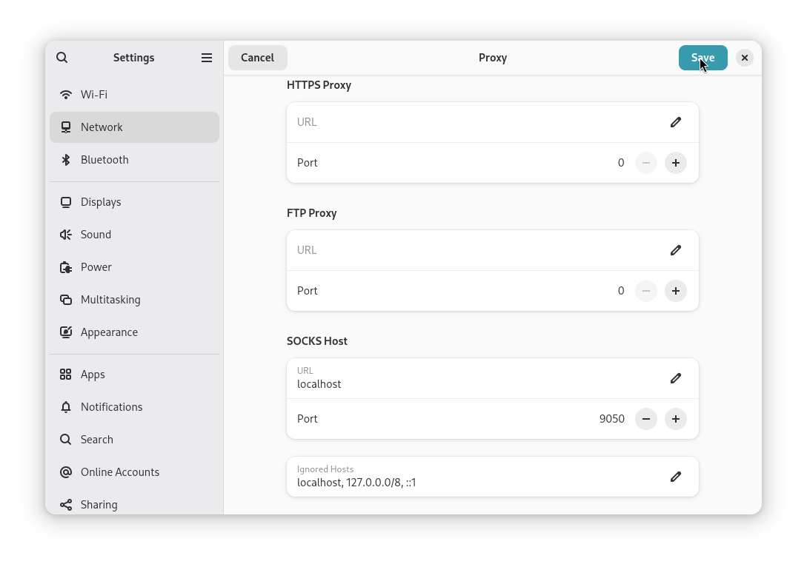
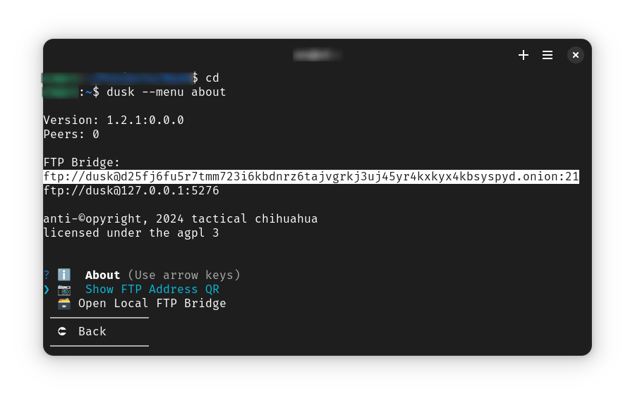
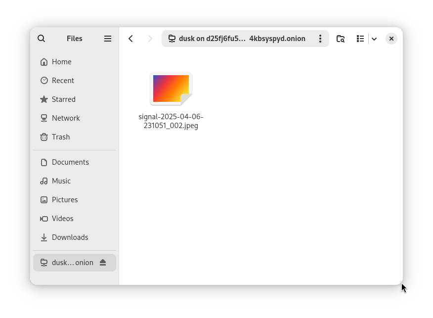

# [🝰 dusk](https://rundusk.org)
# *user guide*
## --

* [Installation](#installation)
* [Basics](#basics)
* [Configuration](#configuration)
* [Sneakernets](#sneakernets)
* [Advanced](#advanced)

---

### Installation

The fastest way to install dusk is running the install script from the console on a Debian-based system. Using [Tails](https://tails.net/) with persistence on a USB or inside a virtual machine on any operating system is recommended for additional security, but not required.

```
curl -o- https://rundusk.org/install.sh | bash
```

You may be prompted for your password.

#### Virtualization

The dusk software is designed and tested to run on Debian under the GNOME desktop environment. Debian is a well-maintained and tested operating system and the GNOME desktop environment provides an excellent experience to users coming to Linux from macOS.

You can run Debian and Dusk inside the operating system of your choosing by using a virtual machine: this allows you to run dusk's environment without making changes to your operating system.

If this sounds scary or hard - don't worry! It's easier than it sounds. The next sections provide a detailed guide on how to get up and running in a virtual machine on Debian, macOS, or Windows.

There are many options for virtualization software for every platform, but this guide will show you how to use the ones that have the simplest feature set to get the job done and are free and open-source

#### MacOS

* Download and install [UTM](https://mac.getutm.app/).
* Download the [Debian Trixie ISO](https://cdimage.debian.org/cdimage/trixie_di_alpha1/amd64/iso-cd/debian-trixie-DI-alpha1-amd64-netinst.iso)
* Create a VM in UTM using the Trixie .iso file you downloaded
* Once installed, the steps are the same as in the Debian section below.

#### Windows

Windows users should expect a similar process as macOS, but using [VirtualBox](https://www.virtualbox.org/wiki/Downloads).

#### Debian

First, download and install [GNOME Boxes](https://apps.gnome.org/Boxes/).

```
sudo apt install gnome-boxes
```

Once installed, open Boxes, click the **Plus +** icon and select Download OS.


Select "Debian Testing x86_64 (netinst)".


Enter **dusk** for the name, ensure **Express Installation** is enabled, enter **dusk** for your username and set a password. Set *Memory* to at least **8.0GiB** and storage to whatever you like (you can change this later).

When you're finished, click **Create**. Wait for the download and installation to finish, it may take a bit.


Once complete, you should have a Debian 12 login screen. Enter the password you set during installation to login.


To install dusk, you'll need administrator privileges. Open the **Terminal** app by pressing the *Super Key* ("Windows" key or "Command" on macOS), typing "Terminal", and pressing enter or clicking the icon that appears.


In **Terminal**, type `su --login` and press **Enter**. Type your password and press Enter again. 

Add the dusk user to the administrator group, by typing `adduser dusk sudo` and pressing Enter. Now restart the virtual machine by clicking the **Power** icon in the top right of the menu bar and selecting **Restart**.


The virtual machine should restart and you'll be returned to the login screen. Log back in and open **Firefox**. Navigate to [rundusk.org](https://rundusk.org) and copy the install command from the homepage.


Open **Terminal** again (*Super Key* , then type "Terminal"). Install cURL, by typing `sudo apt install curl` and pressing *Enter*. Then, right click and paste the install command and press *Enter*.


When the installer is finished, press the *Super Key* and type **Files** or **dusk**. You should see two apps: **dusk:Files** and **dusk:Settings**. Click on **dusk:Files**.


Follow the initial setup prompts.


After dusk is finished, you'll be prompted a final time for the *password you set for dusk* in the previous steps. Enter it to open the **Files** view.


Dusk is now installed and running. Use the virtual operating system to manage your sensitive material. Open **dusk:Settings** to link to other devices, create sneakernets, and more.

### Basics

After installation, you immediately have the ability to store files. However, dusk is running in **seed mode**. This means that you haven't given it any device links to others who are also running dusk. In it's current mode, it is an encrypted virtual filesystem that you can access remotely.

This is useful and provides security, anonymity, and ease of access. However it does not provide durability (ability to recover lost files) or deniability (all your data is stored on a device that you possess). To gain those properties you need some human affinity.

Dusk is not a single unified network - it is ad-hoc and designed to be highly segmented, meaning there are *many* dusk networks that can appear and disappear as their individual group members change and regenerate. In simple terms, you run dusk with your friends, your community, your affinity group.

#### Linking Devices

To take advantage of dusk's deniability properties and strengthen your data security, you'll need to link some devices.

Press the *Super Key*, and type **dusk:Settings** to open the menu. Then, select **Devices** and click OK.


Selecting *Show my device link* and pressing OK will show your unique device link - which you share with members of your affinity network. To link a device, select *Link a new device*, paste the the link you received into the prompt and press OK.

A random short name will be assigned to this device so you can remember who it came from. This device is now a **Link**. Links can be added or removed at any time.


##### Links vs. Peers

Devices that you *link* will be devices that dusk connects to *first*. Through doing so, dusk may discover other devices that add to your network. Those devices are **Peers**. They serve most of the same function as Links, with the exception that dusk will not remember them or try to connect to them on startup.

#### Mobile / Remote Access

Dusk exposes its encrypted virtual file system as a local FTP server. FTP stands for *File Transfer Protocol*. It's an ancient standard from the early internet. It's simple and widely supported on every platform.

> **SFTP** and **WebDAV** support is coming and will provide additional compatibility and ways to access dusk.

FTP does not offer encryption on it's own, but dusk tunnels FTP connections through Tor onion services, which provides end-to-end encryption between your devices. Accessing dusk from another device, such as a phone or tablet (or another computer) just requires an FTP client and a Tor proxy.

Both of these are readily available on every platform. You just need your **FTP Bridge** address. Press the *Super Key* and type **dusk:Settings** and launch the app. Select **About** and click OK.

> You can also run `dusk --menu about` from **Terminal** to print the FTP Bridge onion URL.

You will also be shown the option to display a QR code for easier setup on mobile devices. Follow the guide for your operating system below.

##### Debian

Open the system **Settings** app by pressing the *Super Key* and typing *Settings*. Select **Network** from the left sidebar, click **Proxy** and set **SOCKS Host, URL** to *localhost* and **SOCKS Host, Port** to *9050*. This will tell apps to proxy connections through Tor - which is the only way to connect to your devices running dusk.



From your device running dusk, retrieve your **FTP Bridge** onion address. This can be found in **dusk:Settings, About** or by running `dusk --menu about`.



Open the *system's* **Files** app (also called Nautilus), select **Network** from the sidebar, and paste or type the onion address. Click *Connect*. 


You will see your remote dusk drive in the **Files** app and can use it as you would on the device running dusk.



##### MacOS

TODO

##### Windows

TODO

##### iOS

TODO

##### Android

TODO

### Configuration

A dusk node requires a configuration file to get up and running. The path to this file is given to `dusk` when starting a node (or the defaults will be used).

```
dusk --config myconfig.ini
```

If a configuration file is not supplied, a minimal default configuration is automatically created and used, which will generate a private key, database, and other necessary files. All of this data will be created and stored in `$HOME/.config/dusk`, unless a `--datadir` option is supplied. Valid configuration files may be in either INI or JSON format.

#### DaemonPidFilePath

##### Default: `$HOME/.config/dusk/dusk.pid`

The location to write the PID file for the daemon.

#### PublicKeyPath

##### Default: `$HOME/.config/dusk/dusk.pub`

Path to public key key file.

#### PrivateKeyPath

##### Default: `$HOME/.config/dusk/dusk.key`

Path to private key key file to use for identity.

#### EmbeddedDatabaseDirectory

##### Default: `$HOME/.config/dusk/dusk.dht`

Sets the directory to store DHT entries.

#### NodeListenPort

##### Default: `5274`

Sets the local port to bind the node's RPC service.

#### NodeListenAddress

##### Default: `0.0.0.0`

Sets the address to bind the RPC service.

#### VerboseLoggingEnabled

##### Default: `1`

More detailed logging of messages sent and received. Useful for debugging.

#### LogFilePath

##### Default: `$HEAD/.config/dusk.log`

Path to write the daemon's log file. Log file will rotate either every 24 hours 
or when it exceeds 10MB, whichever happens first.

#### LogFileMaxBackCopies

##### Default: `3`

Maximum number of rotated log files to keep.

#### NetworkBootstrapNodes[]

##### Default: `(empty)`

Add a map of network bootstrap nodes to this section to use for discovering other peers. Default configuration should come with a list of known and trusted contacts.

#### OnionVirtualPort

##### Default: `443`

The virtual port to use for the hidden service.

#### OnionHiddenServiceDirectory

##### Default: `$HOME/.config/dusk/hidden_service`

The directory to store hidden service keys and other information required by the Tor process.

#### OnionLoggingEnabled

##### Default: `0`

Redirects the Tor process log output through dusk's logger for the purpose of debugging.

#### OnionLoggingVerbosity

##### Default: `notice`

Defines the verbosity level of the Tor process logging. Valid options are: `debug`, `info`, `notice`.

#### ControlPortEnabled

##### Default: `0`

Enables the RPC control interface over a TCP socket.

#### ControlPort

##### Default: `5275`

The TCP port to for the control interface to listen on.

#### ControlSockEnabled

##### Default: `1`

Enables the {@link Control} interface over a UNIX domain socket.

#### ControlSock

##### Default: `$HOME/.config/dusk/dusk.sock`

The path to the file to use for the control interface.

#### TestNetworkEnabled

##### Default: `0`

Places dusk into test mode, significantly lowering the identity solution difficulty and the permission solution difficulty.

### Sneakernets

"Sneakernet" is an informal term that refers to transferring data between parties using physical media, like a USB drive, instead of networks. In scenarios where bandwidth is limited, internet access is unavailable, or in cases where the threat model warrants that some data not be transmitted over the internet, sneakernets offer security. They do this in the form of a greatly reduced attack surface, because unauthorized access to data over a sneakernet requires physical access to the media it is stored on.

dusk is built with sneakernets as a transmission model in mind. A subset of the shred/retrace protocol is implemented to function without network access - instead using an array of USB drives. This is called dusk/SHOES (dusk over shoes). SHOES is an acronym for Simple Human Operated Encrypted Sneakernet.

#### dusk/SHOES

> This feature is experimental.

The dusk CLI includes a `--shoes` option that can be used in 3 ways:

* `dusk --shoes` will setup a new dusk/SHOES USB
* `dusk --shred --shoes` will encrypt/shred/encode/distribute a file to `n` USB drives
* `dusk --retrace --shoes` will retrace a file from `n` USB drives, then decrypt and save

Setting up a dusk/SHOES USB functions a lot like setting up dusk on first run. All of the configuration, identity keys, and data directories are created on the USB. The dusk/SHOES USB can even be used to run dusk online later.

Shredding a file follows a guided prompt. Retracing follows a similar process.

### Advanced

#### Command Line Interface

TODO

##### `--shred`

**Shred** takes a file, encrypts it to your key, splits it up into equal segments, generates parity segments (for recovery from data loss), creates a metadata pointer, encrypts the metadata, and depending on your choice either: writes the pieces to a special folder called a `duskbundle`, stores the pieces in the network using the DHT, or transfers them across an array of USB drives (see [Sneakernets](#sneakernets).

To shred a file and store the pieces in the DHT using the control port:

```
dusk --shred --dht --control-port 5275
```

dusk will talk you through the process and keep you updated on progress.

##### `--retrace`

**Retrace** takes an encrypted metadata pointer, decrypts it then depending on your choice either: reads the pieces from a `duskbundle`, downloads the pieces from the network, or reads them from an array of USB drives. Then, retrace will reassmble the pieces, encode any corrupted or missing pieces, decrypt the original file, and save it.

To retrace the same file from the previous example from the DHT:

```
dusk --retrace --dht --control-port 5275
```

dusk will talk you through the process and keep you updated on progress.


The next most important feature is dusk's publish/subscribe system. Nodes can receive arbitrary publications announced through the network by adding the fingerprint of the publisher to their subscriptions. Whenever dusk is handed a PUBLISH message it is interested in, it can trigger a webhook to a onion address.

##### `--test-hooks`

If you are developing an application that uses the pub/sub system, your application will expose an onion service where dusk can send POST requests with the publication contents in the body. Your application can then validate and process those messages according to your needs.

You can test this out using the `--test-hooks` option - which will start a simple onion service that prints messages it receives from dusk to the console. *Do not use this AS IS in production.*