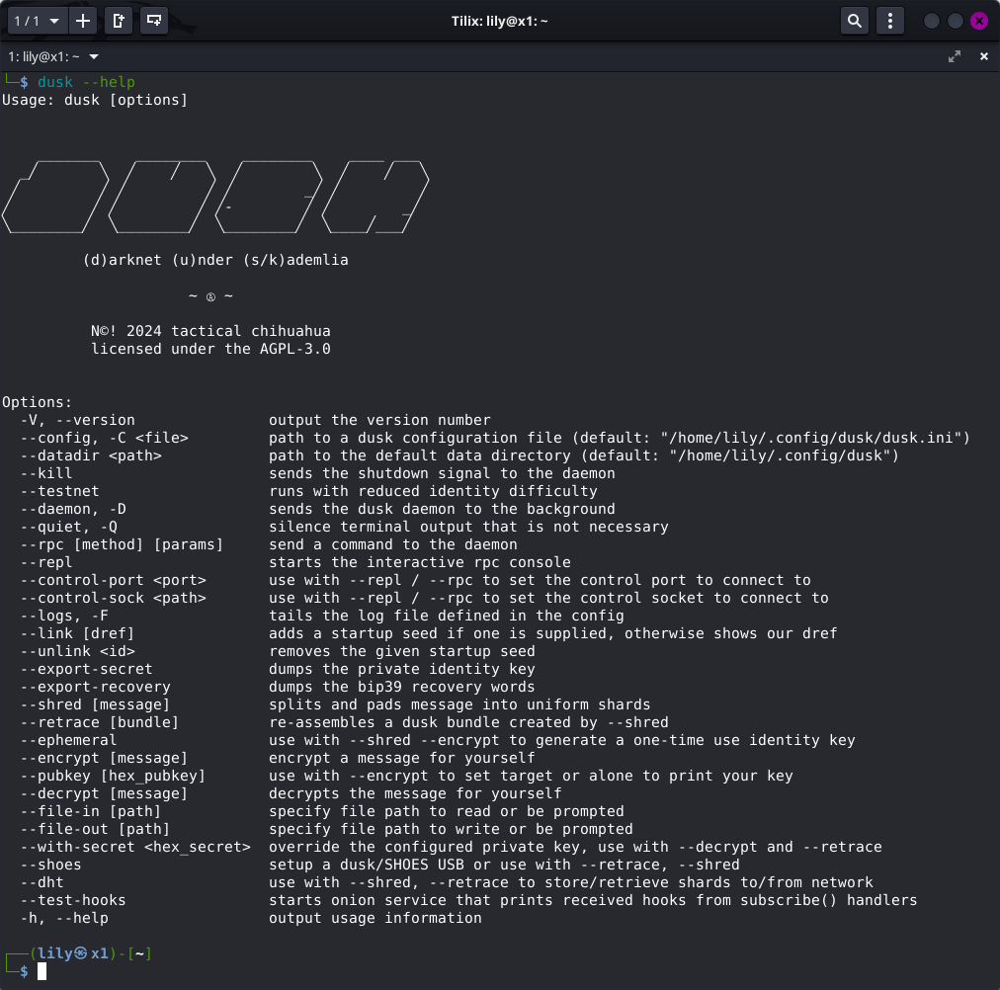
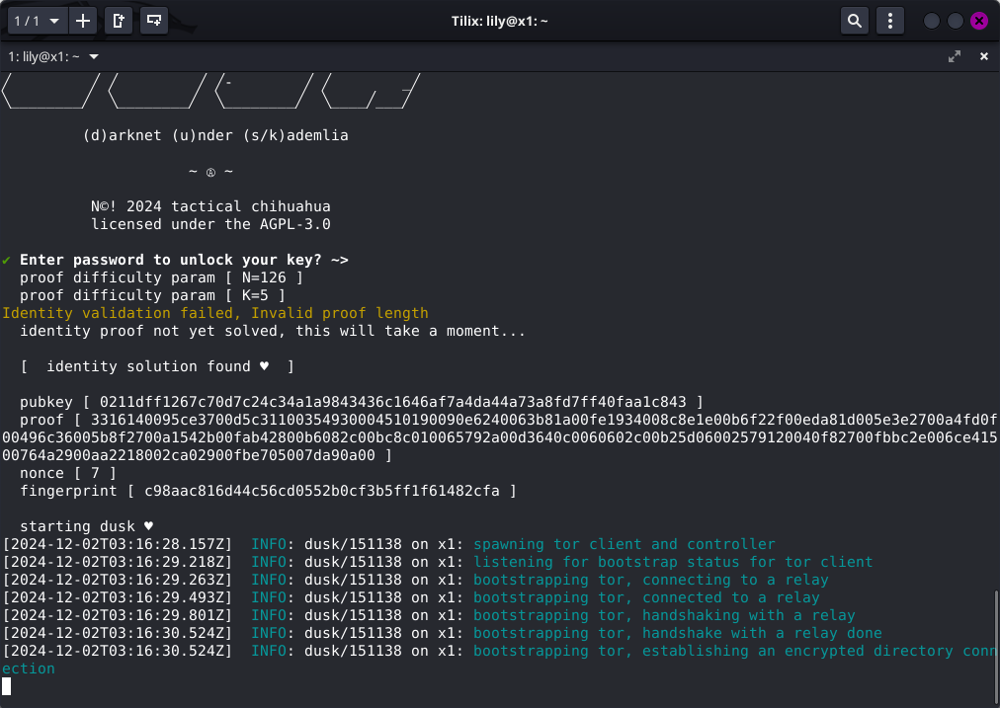
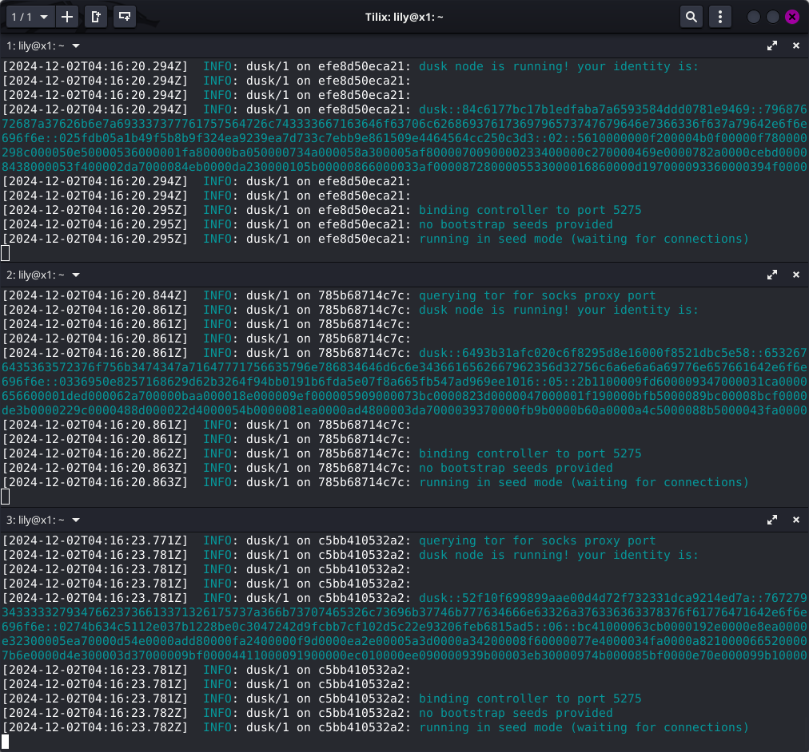
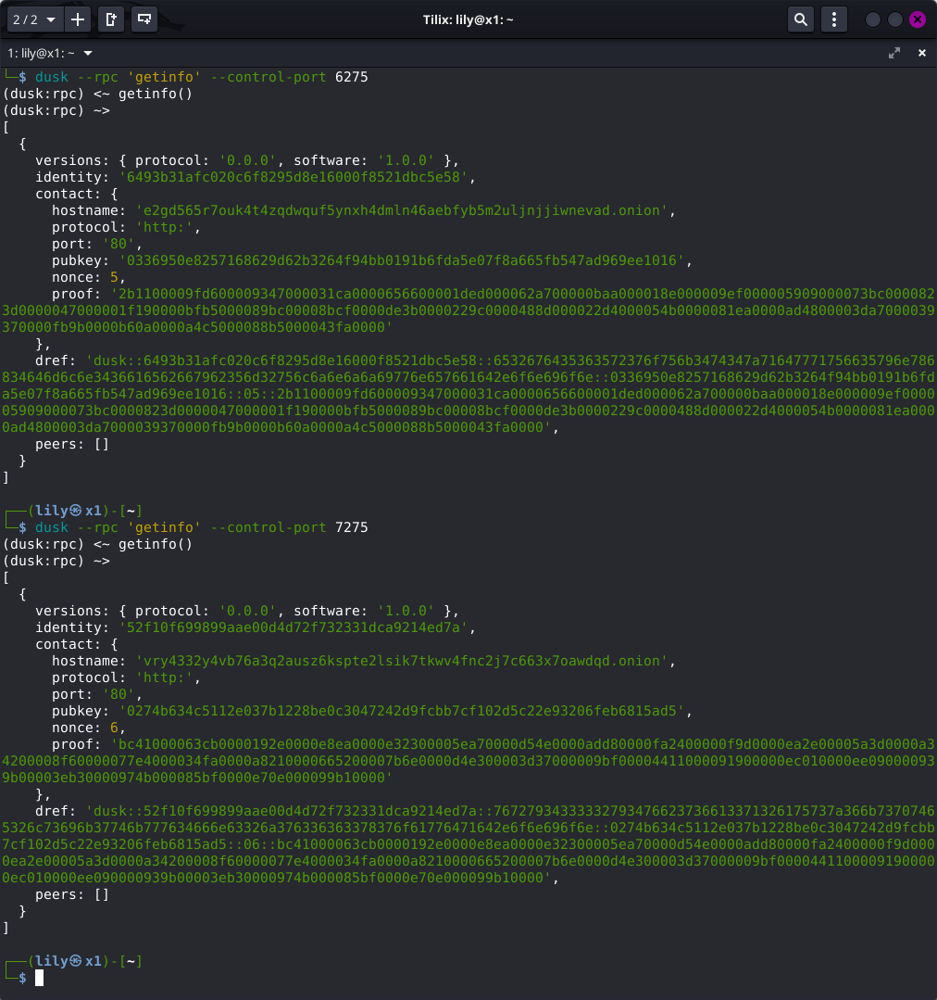
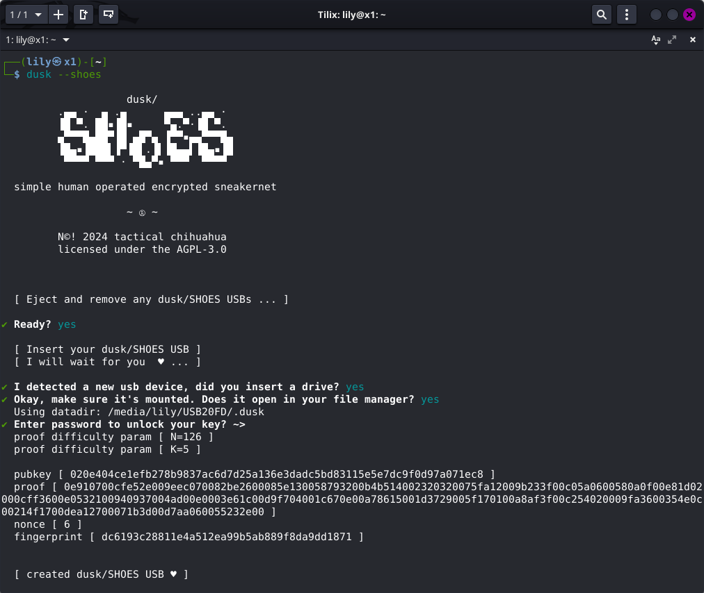
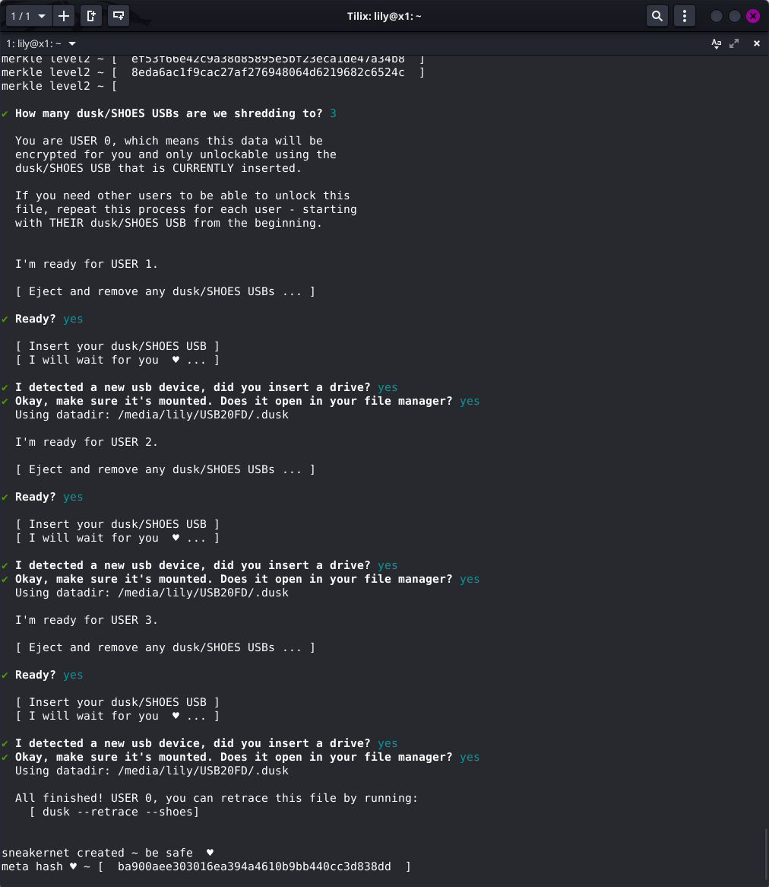

# [🝰 dusk](https://rundusk.org)

## user guide

* [Installation](#installation)
* [Setup](#setup)
* [Basics](#basics)
* [Advanced](#advanced)
* [Configuration](#configuration)
* [Testing](#testing)
* [Sneakernets](#sneakernets)

---

### Installation

Make sure you have the following prerequisites installed:

* [Git](https://git-scm.org)
* [Node.js LTS (22.x)](https://nodejs.org)
* Python3
* GCC/G++/Make
* libudev-dev

You can also skip all of this and use Docker:

```
docker pull tacticalchihuahua/dusk
```

#### Node.js + NPM

##### GNU+Linux & Mac OSX

```
wget -qO- https://raw.githubusercontent.com/nvm-sh/nvm/v0.40.1/install.sh | bash
```

Close your shell and open an new one. Now that you can call the `nvm` program,
install Node.js (which comes with NPM):

```
nvm install --lts
```

#### Build Dependencies

##### GNU+Linux

Debian / Ubuntu / Mint / Trisquel / and Friends

```
apt install git python build-essential libudev-dev
```

Red Hat / Fedora / CentOS

```
yum groupinstall 'Development Tools' libudev-dev
```

You might also find yourself lacking a C++11 compiler - 
[see this](http://hiltmon.com/blog/2015/08/09/c-plus-plus-11-on-centos-6-dot-6/).

##### Mac OSX

```
xcode-select --install
```

#### Daemon

This package exposes the program `dusk`. To install, use the `--global` flag.

```
npm install -g @tacticalchihuahua/dusk
```

#### Library

This package exposes a module providing a complete reference implementation 
of the protocol. To use it in your project, from your project's root 
directory, install as a dependency.

```
npm install @tacticalchihuahua/dusk --save
```

Then you can require the library with:

```
const dusk = require('@tacticalchihuahua/dusk');
```

### Setup

dusk itself does not (yet?) have a graphical interface. It comes with a `dusk` text-based command line interface. Low level node control is achieved by sending RPC commands to `dusk`. The `dusk` CLI also provides tools for configuration, encryption, encoding, key sharing, sneakernet setup, and even a REPL (read-eval-print-loop) - which acts as it's own command-line.

Once you have installed dusk or linked it as a global package, open your Terminal and run `dusk --help`.

 

The CLI will print a list of options and what they do. This is where you'll find tools to interact with dusk. But first you have to start dusk for the first time! In that same Terminal just run `dusk`.

 

The CLI will prompt you to enter a password to protect the key it generated. Then, it will print a list of words and tell you to write them down. Do that and run `dusk` again.

 

Now dusk will start bootstrapping the Tor network connection and eventually it will say it's listening for connections. Now you'll want to connect to someone to discover more of the network. But how? There is no signaling server, no DNS seeds, or list of operating nodes (yet). So, here is where your IRL network comes into play.

Maybe it's your affinity group, your research team, your friends - they need to run dusk too. And you'll exchange "identity bundles" to bootstrap from each other. To do that, we need to ask our dusk node for it. In *another* Terminal, run `dusk --link`.

 

This is like your username. It contains information about how to communicate with your dusk node. Note that your link contains your onion address. Sharing it online could create a anonymity compromise. Share it with your network out of band. When you have exchanged links, run `dusk --rpc "connect <link>"`.

You need a minimum of 3 dusk nodes to form a functioning network. These could be friends, family, colleagues, members of your affinity group, etc. dusk can operate segmented to a small community or connected to a wider global network. 

Run your dusk node in the background with `dusk --daemon`. 

### Basics

The dusk CLI provides a number of tools for interacting with dusk and the network, but there are 2 primary operations to familiarize yourself with first: shred and retrace. 

#### `--shred`

**Shred** takes a file, encrypts it to your key, splits it up into equal segments, generates parity segments (for recovery from data loss), creates a metadata pointer, encrypts the metadata, and depending on your choice either: writes the pieces to a special folder called a `duskbundle`, stores the pieces in the network using the DHT, or transfers them across an array of USB drives (see [Sneakernets](#sneakernets).

To shred a file and store the pieces in the DHT using the control port:

```
dusk --shred --dht --control-port 5275
```

dusk will talk you through the process and keep you updated on progress.

 

#### `--retrace`

**Retrace** takes an encrypted metadata pointer, decrypts it then depending on your choice either: reads the pieces from a `duskbundle`, downloads the pieces from the network, or reads them from an array of USB drives. Then, retrace will reassmble the pieces, encode any corrupted or missing pieces, decrypt the original file, and save it.

To retrace the same file from the previous example from the DHT:

```
dusk --retrace --dht --control-port 5275
```

dusk will talk you through the process and keep you updated on progress.

 

### Advanced

The next most important feature is dusk's publish/subscribe system. Nodes can receive arbitrary publications announced through the network by adding the fingerprint of the publisher to their subscriptions. Whenever dusk is handed a PUBLISH message it is interested in, it can trigger a webhook to a onion address.

#### `--test-hooks`

If you are developing an application that uses the pub/sub system, your application will expose an onion service where dusk can send POST requests with the publication contents in the body. Your application can then validate and process those messages according to your needs.

You can test this out using the `--test-hooks` option - which will start a simple onion service that prints messages it receives from dusk to the console. *Do not use this AS IS in production.*

 

In the screenshot above, one terminal is running `dusk --test-hooks`, one subscribes to publications from a node running in the pictured test network using `dusk --rpc 'subscribe <fingerprint>'`, and the third (the publisher) publishes a message using `dusk --rpc 'publish <hex data>'`.
 
### Configuration

A dusk node requires a configuration file to get up and running. The path to this 
file is given to `dusk` when starting a node (or the defaults will be used).

```
dusk --config myconfig.ini
```

If a configuration file is not supplied, a minimal default configuration is 
automatically created and used, which will generate a private key, database, 
and other necessary files. All of this data will be created and stored in 
`$HOME/.config/dusk`, unless a `--datadir` option is supplied. Valid configuration 
files may be in either INI or JSON format.

#### DaemonPidFilePath

##### Default: `$HOME/.config/dusk/dusk.pid`

The location to write the PID file for the daemon.

#### PublicKeyPath

##### Default: `$HOME/.config/dusk/dusk.pub`

Path to public key key file.

#### PrivateKeyPath

##### Default: `$HOME/.config/dusk/dusk.key`

Path to private key key file to use for identity.

#### EmbeddedDatabaseDirectory

##### Default: `$HOME/.config/dusk/dusk.dht`

Sets the directory to store DHT entries.

#### NodeListenPort

##### Default: `5274`

Sets the local port to bind the node's RPC service.

#### NodeListenAddress

##### Default: `0.0.0.0`

Sets the address to bind the RPC service.

#### VerboseLoggingEnabled

##### Default: `1`

More detailed logging of messages sent and received. Useful for debugging.

#### LogFilePath

##### Default: `$HEAD/.config/dusk.log`

Path to write the daemon's log file. Log file will rotate either every 24 hours 
or when it exceeds 10MB, whichever happens first.

#### LogFileMaxBackCopies

##### Default: `3`

Maximum number of rotated log files to keep.

#### NetworkBootstrapNodes[]

##### Default: `(empty)`

Add a map of network bootstrap nodes to this section to use for discovering 
other peers. Default configuration should come with a list of known and 
trusted contacts.

#### OnionVirtualPort

##### Default: `443`

The virtual port to use for the hidden service.

#### OnionHiddenServiceDirectory

##### Default: `$HOME/.config/dusk/hidden_service`

The directory to store hidden service keys and other information required by 
the Tor process.

#### OnionLoggingEnabled

##### Default: `0`

Redirects the Tor process log output through dusk's logger for the purpose of 
debugging.

#### OnionLoggingVerbosity

##### Default: `notice`

Defines the verbosity level of the Tor process logging. Valid options are: 
`debug`, `info`, `notice`.

#### ControlPortEnabled

##### Default: `0`

Enables the {@link Control} interface over a TCP socket.

#### ControlPort

##### Default: `5275`

The TCP port to for the control interface to listen on.

#### ControlSockEnabled

##### Default: `1`

Enables the {@link Control} interface over a UNIX domain socket.

#### ControlSock

##### Default: `$HOME/.config/dusk/dusk.sock`

The path to the file to use for the control interface.

#### TestNetworkEnabled

##### Default: `0`

Places dusk into test mode, significantly lowering the identity solution
difficulty and the permission solution difficulty.

### Testing

It is mostly straightforward to setup a test environment so you can learn about dusk and how it works. This is also very helpful if you are contributing to the project or developing an application on top of dusk. First you'll want to clone the `main` branch from the git repository and install dependencies. 

```
git clone https://github.com/lilyannehall/dusk
cd dusk
npm install
```

From here, you can run the automated test suites:

```
npm run unit-tests
npm run integration-tests
npm run e2e-tests
npm run linter
```

> Running `npm test` will do all of the above.

Next, you'll probably want to setup a disposable test network to play with. A test network is a "live" network in that nodes communicate with each other like they otherwise would through Tor. The difference is that the difficulty parameters for identity creation are reduced and the secret keys are never saved. You can setup a testnet just using the `dusk` command line, but it may also be desirable to use Docker.

Setting up a testnet without Docker involves creating separate data directories for each node you want to run and modifying each configuration file to listen on different control sockets. Then starting each `dusk` process, letting them each bootstrap, then connecting each one to another using another `dusk` process to send them RPCs.

Using Docker, this can be reduced to a few commands and no configuration since each container is isolated and won't conflict with the others. Here is how to setup a testnet using Docker. 

**First**, build the Docker image (from the dusk source root directory):

```
docker build . -t dusk
```

Once completed, we can start our dusk nodes. We **only need 3** to form a functional network, so in 3 separate terminal windows, run:

```
docker run --publish 6275:5275 -it dusk --testnet --ephemeral
```
```
docker run --publish 7275:5275 -it dusk --testnet --ephemeral
```
```
docker run --publish 8275:5275 -it dusk --testnet --ephemeral
```

The `--publish [port:port]` option tells Docker to bind the first port on the host to the second port inside the container. Port `5275` is the default `ControlPort` that dusk receives local RPC messages on. We are exposing these to our host so we can use our host installation of dusk to control the nodes. The `--testnet` and `--ephemeral` options tell dusk to use lower solution difficulty and to create a disposable secret key. Eventually, all three nodes will say they are in "seed mode"/waiting for connections.

 

Now, we are going to find the dusk links for nodes 2 and 3 then use them to link from node 1. From a *new* terminal window:

```
dusk --rpc 'getinfo' --control-port 7275
dusk --rpc 'getinfo' --control-port 8275
```

 

Each of these commands will print a JSON object with a `dref` property. We want to issue node 1 a `connect` RPC for each of these.

```
dusk --rpc 'connect <dref from node 2>' --control-port 6275
dusk --rpc 'connect <dref from node 3>' --control-port 6275
```

They'll all find each other pretty quick. Check your terminal windows for your nodes. You should see that they are chatting and are aware of each other. You can repeat this process for as many nodes as you want to test against. You can also use `dusk --shred --dht --control-port 6275` and `dusk --retrace --dht --control-port 6275` to test file shredding and retracing over your testnet.

### Sneakernets

"Sneakernet" is an informal term that refers to transferring data between parties using physical media, like a USB drive, instead of networks. In scenarios where bandwidth is limited, internet access is unavailable, or in cases where the threat model warrants that some data not be transmitted over the internet, sneakernets offer security. They do this in the form of a greatly reduced attack surface, because unauthorized access to data over a sneakernet requires physical access to the media it is stored on.

dusk is built with sneakernets as a transmission model in mind. A subset of the shred/retrace protocol is implemented to function without network access - instead using an array of USB drives. This is called dusk/SHOES (dusk over shoes). SHOES is an acronym for Simple Human Operated Encrypted Sneakernet.

#### dusk/SHOES

> This feature is experimental.

The dusk CLI includes a `--shoes` option that can be used in 3 ways:

* `dusk --shoes` will setup a new dusk/SHOES USB
* `dusk --shred --shoes` will encrypt/shred/encode/distribute a file to `n` USB drives
* `dusk --retrace --shoes` will retrace a file from `n` USB drives, then decrypt and save

Setting up a dusk/SHOES USB functions a lot like setting up dusk on first run. All of the configuration, identity keys, and data directories are created on the USB. The dusk/SHOES USB can even be used to run dusk online later.

 

Shredding a file follows a guided prompt.

 

Retracing follows a similar process.