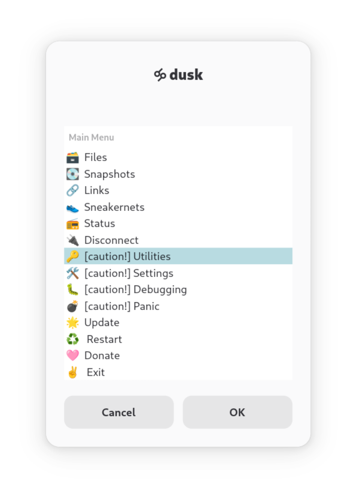
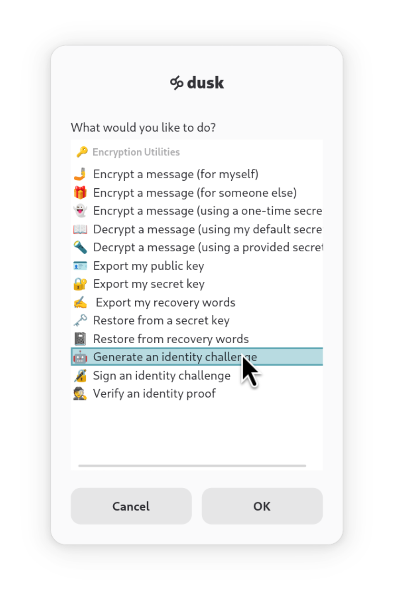
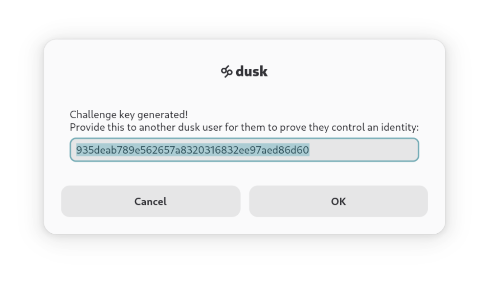
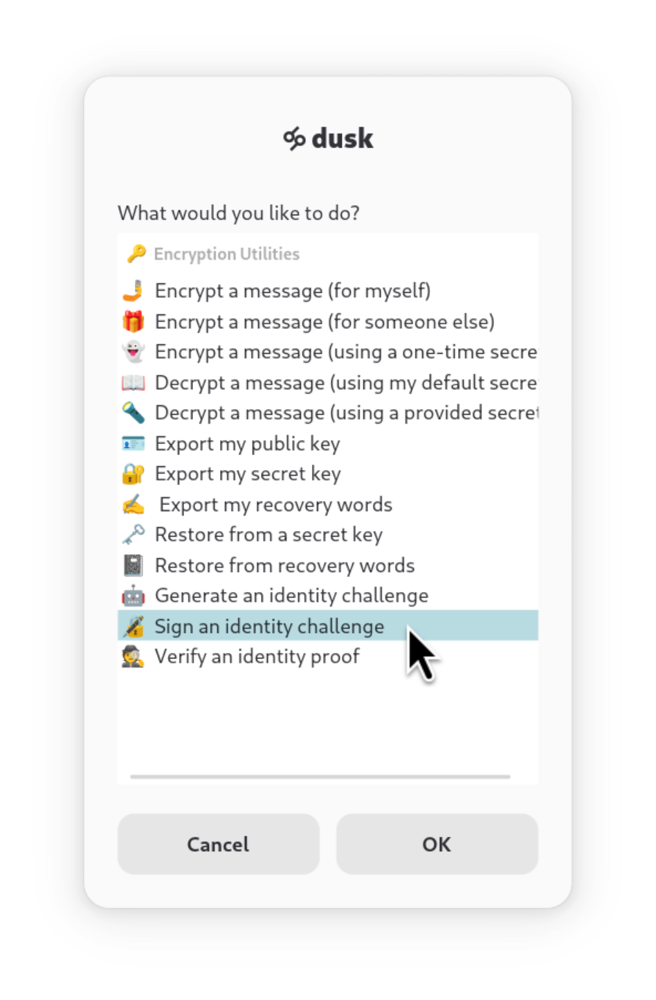
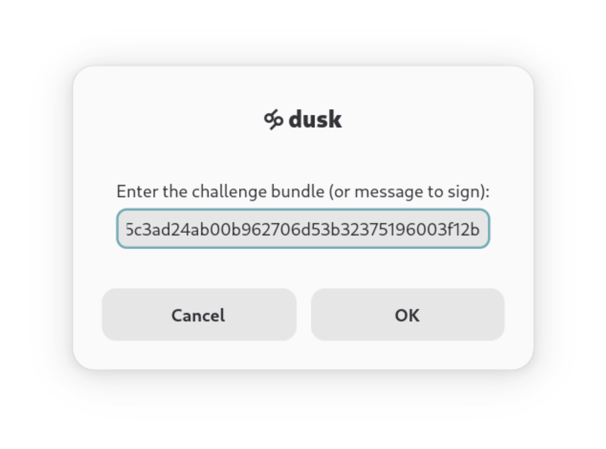
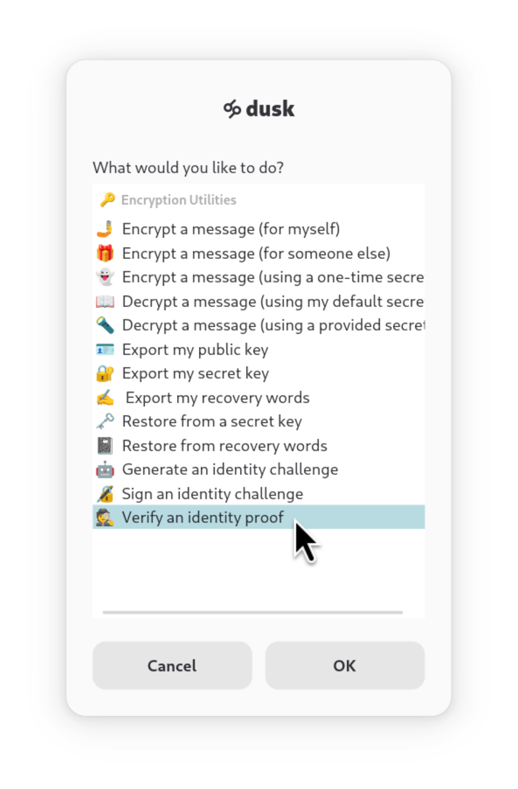
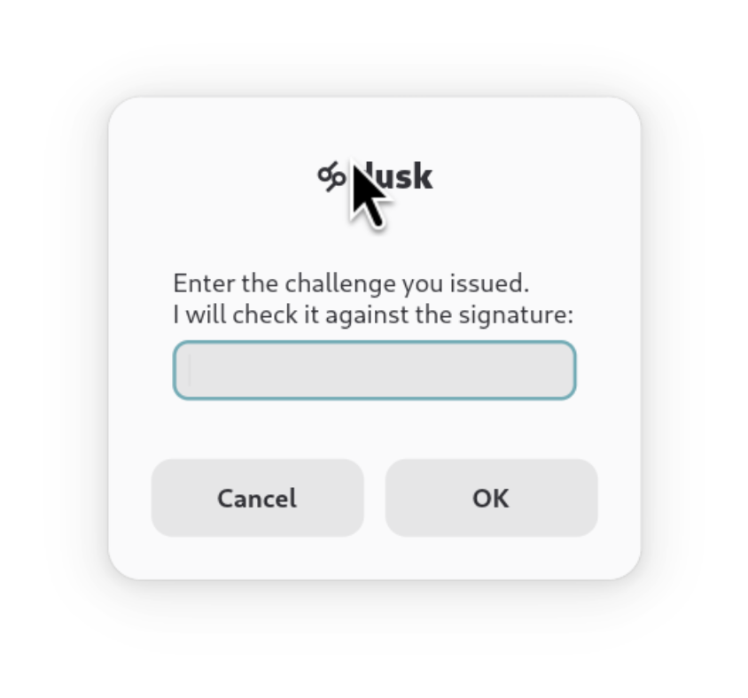

# [🝰 dusk](https://rundusk.org)
# *how to verify a dropbox (and prove ownership)*
## --

> This guide uses the word "identity" to refer to a unique digital key. It does **not** mean your *real* identity and does not contain any identifiable information.


The dusk app provides an optionally enabled anonymous dropbox for receiving content from others. This is exposed as a simple file upload page 
available at an onion address accessible via Tor.

## Onion Address and Fingerprint

There are 2 key pieces of information in verifying control of a dropbox. The *onion address* (**URL**) and the *fingerprint*. 
The onion address is mutable and subject to change. The fingerprint, however, should never change - it is tied to a cryptographic 
proof that dusk enforces to mitigate a variety of identity attacks (described in the [whitepaper](whitepaper.md)).

If you want to be certain that the person controlling the dropbox is the person you intend to submit file(s) to, you can ask them 
to sign an identity challenge. This involves generating a unique key and requesting that the recipient provide a digital signature that: 

* Proves ownership of the decryption key
* Attests that the dropbox address is correct

The dusk app makes this easy to do.

## Challening Identity (for senders)

### Using the App

Open dusk and select *caution! Utilities*.



Select *Generate an identity challenge*.



Copy the generated challenge code and ask the recipient to create an identity proof.



### Using the Command Line

You can follow the same steps after running `dusk --menu` or use the CLI directly.

```
dusk --gen-challenge
```

## Proving Control (for recipients)

When a source asks you for an identity proof

### Using the App

Open dusk and select *caution! Utilities*, then select *Sign an identity challenge*.



Enter the challenge you received from the sender.



Copy the digital signature and provide it back to the sender, so they may verify it.


### Using the Command Line

## Verifying an Identity Proof

### Using the App

Open dusk and select *caution! Utilities*, then select *Verify an identity proof*.



Enter the signature you received from the recipient.



The signature will be validated and dusk will tell you if it is authentic.

### Using the Command Line

Simply run `dusk --verify --use-challenge` and follow the prompts.
